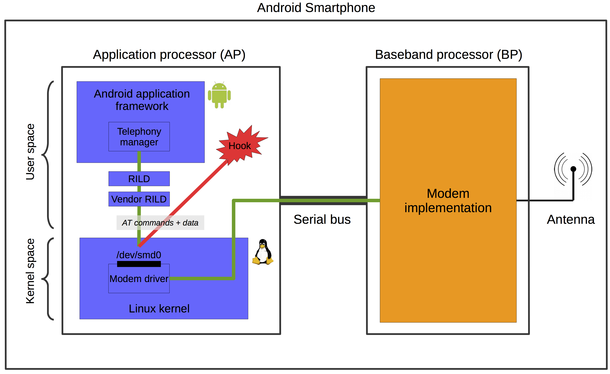

# Class-0-PDU-Creator
PDU Creator for Class 0 SMS
  

  
<b>Send Code to Android</b>
  
<pre>Example : 
ls -la /dev | grep -a smd 
cat /dev/smd11
echo -e "AT+CMGS=47\r" > /dev/smd11
cat /dev/smd11
07215063993856F8040b215063931049F000002290118050330c20CDB21C1D16875920711D244ECB41C76913442EBBCBEDF23C4D4ECB5D
</pre>
  
<table style="width: 99.82%; border-collapse: collapse;" border="1" width="99%" cellspacing="0" cellpadding="0">
<tbody>
<tr>
<td style="width: 48.2%; border-width: 1pt medium 1pt 1pt; border-style: solid none solid solid; border-color: #b3cc82 -moz-use-text-color #b3cc82 #b3cc82; background: none repeat scroll 0% 0% #9bbb59; padding: 0cm 5.4pt;" valign="top" width="48%">

<strong>Command</strong>

</td>
<td style="width: 51.8%; border-width: 1pt 1pt 1pt medium; border-style: solid solid solid none; border-color: #b3cc82 #b3cc82 #b3cc82 -moz-use-text-color; background: none repeat scroll 0% 0% #9bbb59; padding: 0cm 5.4pt;" valign="top" width="51%">

<strong>Description</strong>

</td>
</tr>
<tr>
<td style="width: 48.2%; border-width: medium medium 1pt 1pt; border-style: none none solid solid; border-color: -moz-use-text-color -moz-use-text-color #b3cc82 #b3cc82; background: none repeat scroll 0% 0% #e6eed5; padding: 0cm 5.4pt;" valign="top" width="48%">

AT+CSMS

</td>
<td style="width: 51.8%; border-width: medium 1pt 1pt medium; border-style: none solid solid none; border-color: -moz-use-text-color #b3cc82 #b3cc82 -moz-use-text-color; background: none repeat scroll 0% 0% #e6eed5; padding: 0cm 5.4pt;" valign="top" width="51%">

Select message service

</td>
</tr>
<tr>
<td style="width: 48.2%; border-width: medium medium 1pt 1pt; border-style: none none solid solid; border-color: -moz-use-text-color -moz-use-text-color #b3cc82 #b3cc82; padding: 0cm 5.4pt;" valign="top" width="48%">

AT+CPMS

</td>
<td style="width: 51.8%; border-width: medium 1pt 1pt medium; border-style: none solid solid none; border-color: -moz-use-text-color #b3cc82 #b3cc82 -moz-use-text-color; padding: 0cm 5.4pt;" valign="top" width="51%">

Preferred message storage

</td>
</tr>
<tr>
<td style="width: 48.2%; border-width: medium medium 1pt 1pt; border-style: none none solid solid; border-color: -moz-use-text-color -moz-use-text-color #b3cc82 #b3cc82; background: none repeat scroll 0% 0% #e6eed5; padding: 0cm 5.4pt;" valign="top" width="48%">

AT+CMGF

</td>
<td style="width: 51.8%; border-width: medium 1pt 1pt medium; border-style: none solid solid none; border-color: -moz-use-text-color #b3cc82 #b3cc82 -moz-use-text-color; background: none repeat scroll 0% 0% #e6eed5; padding: 0cm 5.4pt;" valign="top" width="51%">

Message format

</td>
</tr>
<tr>
<td style="width: 48.2%; border-width: medium medium 1pt 1pt; border-style: none none solid solid; border-color: -moz-use-text-color -moz-use-text-color #b3cc82 #b3cc82; padding: 0cm 5.4pt;" valign="top" width="48%">

AT+CSCA

</td>
<td style="width: 51.8%; border-width: medium 1pt 1pt medium; border-style: none solid solid none; border-color: -moz-use-text-color #b3cc82 #b3cc82 -moz-use-text-color; padding: 0cm 5.4pt;" valign="top" width="51%">

Service centre address

</td>
</tr>
<tr>
<td style="width: 48.2%; border-width: medium medium 1pt 1pt; border-style: none none solid solid; border-color: -moz-use-text-color -moz-use-text-color #b3cc82 #b3cc82; background: none repeat scroll 0% 0% #e6eed5; padding: 0cm 5.4pt;" valign="top" width="48%">

AT+CSMP

</td>
<td style="width: 51.8%; border-width: medium 1pt 1pt medium; border-style: none solid solid none; border-color: -moz-use-text-color #b3cc82 #b3cc82 -moz-use-text-color; background: none repeat scroll 0% 0% #e6eed5; padding: 0cm 5.4pt;" valign="top" width="51%">

Set text mode parameters

</td>
</tr>
<tr>
<td style="width: 48.2%; border-width: medium medium 1pt 1pt; border-style: none none solid solid; border-color: -moz-use-text-color -moz-use-text-color #b3cc82 #b3cc82; padding: 0cm 5.4pt;" valign="top" width="48%">

AT+CSDH

</td>
<td style="width: 51.8%; border-width: medium 1pt 1pt medium; border-style: none solid solid none; border-color: -moz-use-text-color #b3cc82 #b3cc82 -moz-use-text-color; padding: 0cm 5.4pt;" valign="top" width="51%">

Show text mode parameters

</td>
</tr>
<tr>
<td style="width: 48.2%; border-width: medium medium 1pt 1pt; border-style: none none solid solid; border-color: -moz-use-text-color -moz-use-text-color #b3cc82 #b3cc82; background: none repeat scroll 0% 0% #e6eed5; padding: 0cm 5.4pt;" valign="top" width="48%">

AT+CSCB

</td>
<td style="width: 51.8%; border-width: medium 1pt 1pt medium; border-style: none solid solid none; border-color: -moz-use-text-color #b3cc82 #b3cc82 -moz-use-text-color; background: none repeat scroll 0% 0% #e6eed5; padding: 0cm 5.4pt;" valign="top" width="51%">

Select cell broadcast message types

</td>
</tr>
<tr>
<td style="width: 48.2%; border-width: medium medium 1pt 1pt; border-style: none none solid solid; border-color: -moz-use-text-color -moz-use-text-color #b3cc82 #b3cc82; padding: 0cm 5.4pt;" valign="top" width="48%">

AT+CSAS

</td>
<td style="width: 51.8%; border-width: medium 1pt 1pt medium; border-style: none solid solid none; border-color: -moz-use-text-color #b3cc82 #b3cc82 -moz-use-text-color; padding: 0cm 5.4pt;" valign="top" width="51%">

Save settings

</td>
</tr>
<tr>
<td style="width: 48.2%; border-width: medium medium 1pt 1pt; border-style: none none solid solid; border-color: -moz-use-text-color -moz-use-text-color #b3cc82 #b3cc82; background: none repeat scroll 0% 0% #e6eed5; padding: 0cm 5.4pt;" valign="top" width="48%">

AT+CRES

</td>
<td style="width: 51.8%; border-width: medium 1pt 1pt medium; border-style: none solid solid none; border-color: -moz-use-text-color #b3cc82 #b3cc82 -moz-use-text-color; background: none repeat scroll 0% 0% #e6eed5; padding: 0cm 5.4pt;" valign="top" width="51%">

Restore settings

</td>
</tr>
<tr>
<td style="width: 48.2%; border-width: medium medium 1pt 1pt; border-style: none none solid solid; border-color: -moz-use-text-color -moz-use-text-color #b3cc82 #b3cc82; padding: 0cm 5.4pt;" valign="top" width="48%">

AT+CNMI

</td>
<td style="width: 51.8%; border-width: medium 1pt 1pt medium; border-style: none solid solid none; border-color: -moz-use-text-color #b3cc82 #b3cc82 -moz-use-text-color; padding: 0cm 5.4pt;" valign="top" width="51%">

New message indications to TE

</td>
</tr>
<tr>
<td style="width: 48.2%; border-width: medium medium 1pt 1pt; border-style: none none solid solid; border-color: -moz-use-text-color -moz-use-text-color #b3cc82 #b3cc82; background: none repeat scroll 0% 0% #e6eed5; padding: 0cm 5.4pt;" valign="top" width="48%">

AT+CMGL

</td>
<td style="width: 51.8%; border-width: medium 1pt 1pt medium; border-style: none solid solid none; border-color: -moz-use-text-color #b3cc82 #b3cc82 -moz-use-text-color; background: none repeat scroll 0% 0% #e6eed5; padding: 0cm 5.4pt;" valign="top" width="51%">

List messages

</td>
</tr>
<tr>
<td style="width: 48.2%; border-width: medium medium 1pt 1pt; border-style: none none solid solid; border-color: -moz-use-text-color -moz-use-text-color #b3cc82 #b3cc82; padding: 0cm 5.4pt;" valign="top" width="48%">

AT+CMGR

</td>
<td style="width: 51.8%; border-width: medium 1pt 1pt medium; border-style: none solid solid none; border-color: -moz-use-text-color #b3cc82 #b3cc82 -moz-use-text-color; padding: 0cm 5.4pt;" valign="top" width="51%">

Read message

</td>
</tr>
<tr>
<td style="width: 48.2%; border-width: medium medium 1pt 1pt; border-style: none none solid solid; border-color: -moz-use-text-color -moz-use-text-color #b3cc82 #b3cc82; background: none repeat scroll 0% 0% #e6eed5; padding: 0cm 5.4pt;" valign="top" width="48%">

AT+CMGS

</td>
<td style="width: 51.8%; border-width: medium 1pt 1pt medium; border-style: none solid solid none; border-color: -moz-use-text-color #b3cc82 #b3cc82 -moz-use-text-color; background: none repeat scroll 0% 0% #e6eed5; padding: 0cm 5.4pt;" valign="top" width="51%">

Send message

</td>
</tr>
<tr>
<td style="width: 48.2%; border-width: medium medium 1pt 1pt; border-style: none none solid solid; border-color: -moz-use-text-color -moz-use-text-color #b3cc82 #b3cc82; padding: 0cm 5.4pt;" valign="top" width="48%">

AT+CMSS

</td>
<td style="width: 51.8%; border-width: medium 1pt 1pt medium; border-style: none solid solid none; border-color: -moz-use-text-color #b3cc82 #b3cc82 -moz-use-text-color; padding: 0cm 5.4pt;" valign="top" width="51%">

Send message from storage

</td>
</tr>
<tr>
<td style="width: 48.2%; border-width: medium medium 1pt 1pt; border-style: none none solid solid; border-color: -moz-use-text-color -moz-use-text-color #b3cc82 #b3cc82; background: none repeat scroll 0% 0% #e6eed5; padding: 0cm 5.4pt;" valign="top" width="48%">

AT+CMGW

</td>
<td style="width: 51.8%; border-width: medium 1pt 1pt medium; border-style: none solid solid none; border-color: -moz-use-text-color #b3cc82 #b3cc82 -moz-use-text-color; background: none repeat scroll 0% 0% #e6eed5; padding: 0cm 5.4pt;" valign="top" width="51%">

Write message to memory

</td>
</tr>
<tr>
<td style="width: 48.2%; border-width: medium medium 1pt 1pt; border-style: none none solid solid; border-color: -moz-use-text-color -moz-use-text-color #b3cc82 #b3cc82; padding: 0cm 5.4pt;" valign="top" width="48%">

AT+CMGD

</td>
<td style="width: 51.8%; border-width: medium 1pt 1pt medium; border-style: none solid solid none; border-color: -moz-use-text-color #b3cc82 #b3cc82 -moz-use-text-color; padding: 0cm 5.4pt;" valign="top" width="51%">

Delete message

</td>
</tr>
</tbody>
</table>

<table style="width: 99.82%; border-collapse: collapse;" border="1" width="99%" cellspacing="0" cellpadding="0">
<tbody>
<tr>
<td style="width: 48.22%; border-width: 1pt medium 1pt 1pt; border-style: solid none solid solid; border-color: #b3cc82 -moz-use-text-color #b3cc82 #b3cc82; background: none repeat scroll 0% 0% #9bbb59; padding: 0cm 5.4pt;" valign="top" width="48%">

<strong>Command</strong>

</td>
<td style="width: 51.78%; border-width: 1pt 1pt 1pt medium; border-style: solid solid solid none; border-color: #b3cc82 #b3cc82 #b3cc82 -moz-use-text-color; background: none repeat scroll 0% 0% #9bbb59; padding: 0cm 5.4pt;" valign="top" width="51%">

<strong>Description</strong>

</td>
</tr>
<tr>
<td style="width: 48.22%; border-width: medium medium 1pt 1pt; border-style: none none solid solid; border-color: -moz-use-text-color -moz-use-text-color #b3cc82 #b3cc82; background: none repeat scroll 0% 0% #e6eed5; padding: 0cm 5.4pt;" valign="top" width="48%">

AT+CMGL

</td>
<td style="width: 51.78%; border-width: medium 1pt 1pt medium; border-style: none solid solid none; border-color: -moz-use-text-color #b3cc82 #b3cc82 -moz-use-text-color; background: none repeat scroll 0% 0% #e6eed5; padding: 0cm 5.4pt;" valign="top" width="51%">

List Messages

</td>
</tr>
<tr>
<td style="width: 48.22%; border-width: medium medium 1pt 1pt; border-style: none none solid solid; border-color: -moz-use-text-color -moz-use-text-color #b3cc82 #b3cc82; padding: 0cm 5.4pt;" valign="top" width="48%">

AT+CMGR

</td>
<td style="width: 51.78%; border-width: medium 1pt 1pt medium; border-style: none solid solid none; border-color: -moz-use-text-color #b3cc82 #b3cc82 -moz-use-text-color; padding: 0cm 5.4pt;" valign="top" width="51%">

Read message

</td>
</tr>
<tr>
<td style="width: 48.22%; border-width: medium medium 1pt 1pt; border-style: none none solid solid; border-color: -moz-use-text-color -moz-use-text-color #b3cc82 #b3cc82; background: none repeat scroll 0% 0% #e6eed5; padding: 0cm 5.4pt;" valign="top" width="48%">

AT+CMGS

</td>
<td style="width: 51.78%; border-width: medium 1pt 1pt medium; border-style: none solid solid none; border-color: -moz-use-text-color #b3cc82 #b3cc82 -moz-use-text-color; background: none repeat scroll 0% 0% #e6eed5; padding: 0cm 5.4pt;" valign="top" width="51%">

Send message

</td>
</tr>
<tr>
<td style="width: 48.22%; border-width: medium medium 1pt 1pt; border-style: none none solid solid; border-color: -moz-use-text-color -moz-use-text-color #b3cc82 #b3cc82; padding: 0cm 5.4pt;" valign="top" width="48%">

AT+CMGW

</td>
<td style="width: 51.78%; border-width: medium 1pt 1pt medium; border-style: none solid solid none; border-color: -moz-use-text-color #b3cc82 #b3cc82 -moz-use-text-color; padding: 0cm 5.4pt;" valign="top" width="51%">

Write message to memory

</td>
</tr>
</tbody>
</table>

Source : https://www.engineersgarage.com/at-commands-gsm-at-command-set/

